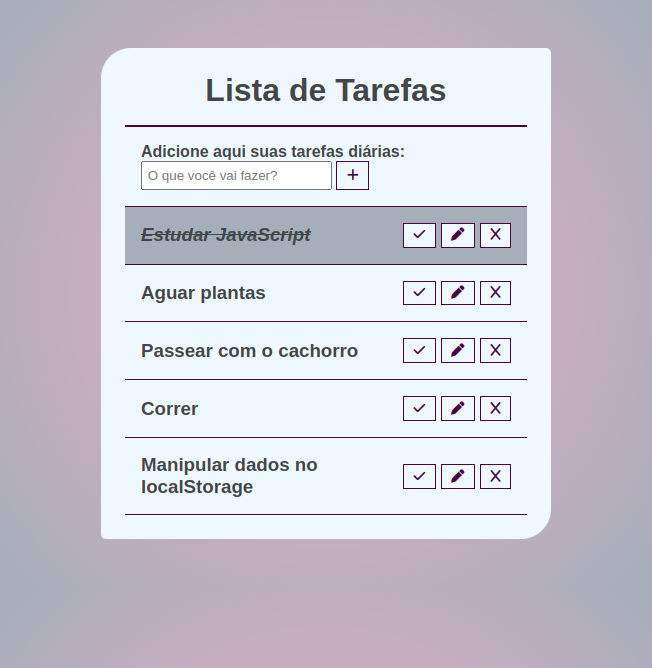

# To-Do List 

Este é um projeto de uma lista de tarefas para que o usuário consiga adicionar suas atividades diárias. 

## Índice

- [Visão geral](#visão-geral)
  - [O desafio](#o-desafio)
  - [Captura de tela](#captura-de-tela)
  - [Links](#links)
- [Meu processo](#meu-processo)
  - [Tecnologias utilizadas](#tecnologias-utilizadas)
  - [O que aprendi](#o-que-aprendi)
  - [Status do projeto](#status-do-projeto)
  - [Recursos úteis](#recursos-úteis)
- [Autora](#autora)
- [Licença](#licença)

## Visão geral

### O desafio

Os usuários devem ser capazes de:

- Adicionar tarefas 
- Remover tarefas
- Editar tarefas

### Captura de tela



### Links

- URL da solução: [GitHub](https://github.com/adynaslima/Projeto-To-Do-List.git)
- URL do site: [Deploy](https://projeto-to-do-list-ebon.vercel.app/)

## Meu processo

### Tecnologias utilizadas

- Marcação HTML5 semântica
- Propriedades personalizadas CSS
- Flexbox
- JavaScript

### O que aprendi

```js
    const updateTodo = (text) => {

        const todos = document.querySelectorAll(".todo");

        todos.forEach((todo) => {
            let todoTitle = todo.querySelector("h3");

            if (todoTitle.innerText === oldInputValue) {
                todoTitle.innerText = text;
            }
        });
    };
```

### Status do projeto

Em construção...

### Recursos úteis

- [To Do List com JavaScript puro](https://www.youtube.com/watch?v=HSssE1PRQcA&t=28s) - Esse vídeo me ajudou a fazer a lista de tarefas. Recomendo a todos. 

## Autora

- GitHub - [Adyna Lima](https://github.com/adynaslima)
- LinkedIn - [Adyna Lima](https://www.linkedin.com/in/adynalima/)

## Licença

Este projeto está licenciado nos termos da licença MIT.